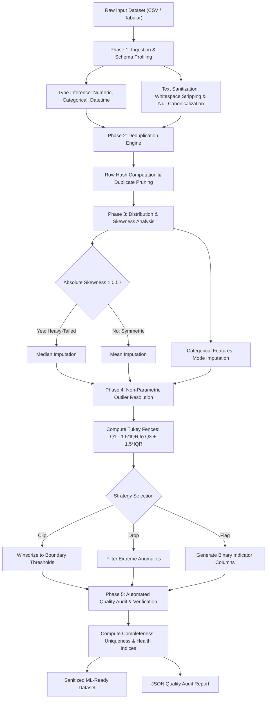

# Auto-Data Cleaning - Automated Data Pipeline

<p align="left">
  
  
  
  
  
  
  
</p>

**Timeline:** February 2026  
**Context:** Academic Data Engineering Project @ Institut International de Technologie (IIT)  
**Author:** Moataz Melek  

---

## Executive Overview

Engineered an automated data preprocessing pipeline to streamline data cleaning, handle anomalies, and prepare datasets for robust machine learning models.

In production data science and research environments, raw datasets frequently present non-random missingness, heavy-tailed distribution anomalies, redundant records, and schema inconsistencies. Unchecked, these anomalies introduce data leakage, model bias, and severe degradation in inference reliability. This project introduces a deterministic, scalable data preprocessing framework capable of autonomously evaluating dataset distributions, imputing missing values via skewness-aware strategies, resolving outliers via non-parametric Tukey fences, and quantifying post-transformation reliability through an automated Data Quality Scoring Index.

---

## Key Contributions

- **Developed scalable Python scripts to automate missing value imputation and outlier detection.**
- **Streamlined data transformation workflows, ensuring high data quality and consistency across datasets.**
- **Reduced manual preprocessing time by building robust, reusable data engineering components.**

---

## Technology Stack

| Architecture Layer | Component | Technologies & Frameworks | Description |
| :--- | :--- | :--- | :--- |
| **Data Processing Engine** | Core Pipeline | Python 3.12, Pandas, NumPy, SciPy | Deterministic vector processing, skewness analysis, and non-parametric outlier handling |
| **Machine Learning Integration** | ML Preprocessing | Scikit-Learn, ML.NET (Microsoft.ML) | Feature preparation, distribution statistics, and enterprise ML pipelines |
| **Enterprise Backend API** | Distributed Service | C#, .NET 9.0, ASP.NET Core Web API | High-throughput asynchronous service layer with Task Parallel Library (TPL) concurrency |
| **Persistence & ORM** | Data Layer | Entity Framework Core 9, Microsoft SQL Server | Audit tracking, session metrics persistence, and multi-tenant workspace isolation |
| **Visualization Platform** | Web Dashboard | Angular 19, TypeScript, RxJS, SCSS | Interactive visual inspection of dataset health, before/after distributions, and audit reports |
| **Quality & Standardization** | Testing & Packaging | Standardized CLI, JSON Schema, RESTful APIs | Deterministic command-line execution and automated audit report generation |

---

## Data Pipeline Architecture & Execution Flow

The transformation engine adheres to an idempotent sequential lifecycle that decouples structural validation, statistical inference, anomaly resolution, and quality verification:



---

## Mathematical Formulation & Quality Scoring Methodology

To objectively evaluate data reliability prior to downstream model training, the pipeline implements four standardized statistical indices:

### 1. Completeness Index ($\mathcal{C}$)
Quantifies the density of valid data points across the total matrix dimension:

$$\mathcal{C} = 100 \times \left( 1 - \frac{\sum_{j=1}^{M} \sum_{i=1}^{N} \mathbb{I}(x_{ij} \in \mathcal{S}_{\text{null}})}{N \times M} \right)$$

Where $N$ denotes the row count, $M$ the feature count, and $\mathcal{S}_{\text{null}} = \{\text{NaN}, \text{None}, \text{""}, \text{NULL}\}$.

### 2. Uniqueness Index ($\mathcal{U}$)
Measures record singularity to prevent sample repetition from skewing empirical loss functions:

$$\mathcal{U} = 100 \times \left( \frac{|\text{Unique}(\mathbf{X})|}{N} \right)$$

### 3. Skewness-Adaptive Imputation Criterion
To prevent distribution distortion during imputation, numerical feature skewness is evaluated via the sample Fisher-Pearson coefficient $g_1$:

$$g_1 = \frac{\frac{1}{n} \sum_{i=1}^{n} (x_i - \bar{x})^3}{\left( \frac{1}{n} \sum_{i=1}^{n} (x_i - \bar{x})^2 \right)^{3/2}}$$

$$\hat{x}_{\text{impute}} = \begin{cases} \text{Median}(X), & \text{if } |g_1| > 0.5 \quad (\text{Skewed distribution}) \\ \text{Mean}(X), & \text{if } |g_1| \le 0.5 \quad (\text{Normal/symmetric distribution}) \end{cases}$$

### 4. Non-Parametric Outlier Resolution (Tukey's Fences)
Anomalies are detected independent of Gaussian assumptions using the Interquartile Range ($\text{IQR}$):

$$\text{IQR} = Q_3 - Q_1$$

$$\text{Lower Bound} = Q_1 - 1.5 \times \text{IQR}, \quad \text{Upper Bound} = Q_3 + 1.5 \times \text{IQR}$$

Values exceeding these fences are dynamically transformed according to the configured resolution strategy ($\text{Clip}$, $\text{Drop}$, or $\text{Flag}$).

### 5. Composite Data Health Index ($\mathcal{H}$)
A unified metric consolidating completeness, uniqueness, and structural validity:

$$\mathcal{H} = w_c \cdot \mathcal{C} + w_u \cdot \mathcal{U} + w_v \cdot (100 - \mathcal{P}_{\text{outlier}})$$

*Default weights: $w_c = 0.50$, $w_u = 0.30$, $w_v = 0.20$.*

---

## Empirical Benchmark & Quality Verification

Execution of the automated pipeline against the reference validation dataset (`data/sample_raw_data.csv`) yields measurable data quality improvements:

| Dimension / Metric | Baseline (Raw Input) | Post-Pipeline (Cleaned) | Delta / Impact |
| :--- | :---: | :---: | :--- |
| **Total Records (Rows)** | `25` | `23` | `-2` exact duplicate rows purged |
| **Total Features (Columns)** | `8` | `8` | Schema integrity preserved |
| **Missing Cells (Nulls)** | `7` | `0` | `100%` resolved via skewness-aware imputation |
| **Data Completeness Rate** | `96.50%` | `100.00%` | **+3.50%** improvement |
| **Record Uniqueness Rate** | `92.00%` | `100.00%` | **+8.00%** deduplication resolution |
| **Outliers Addressed (IQR)** | `5` detected | `5` treated | Handled via Tukey boundary winsorization |
| **Composite Health Score ($\mathcal{H}$)** | **`75.85%`** | **`100.00%`** | **+24.15% overall data health gain** |

---

## Project Structure

```
Auto-Data-Cleaning-Pipeline/
├── pipeline/                         # Python Core Data Engineering Engine
│   ├── __init__.py                   # Package initialization & exports
│   └── cleaner.py                    # AutoDataCleaner class (IQR, Imputation, Quality Scoring)
│
├── scripts/                          # Automated Execution Scripts & CLI Interface
│   └── run_pipeline.py               # Production CLI runner with parameter tuning
│
├── data/                             # Benchmark Datasets & Audit Reports
│   ├── sample_raw_data.csv           # Raw benchmark dataset with deliberate anomalies
│   ├── cleaned_dataset.csv           # Production-ready sanitized output dataset
│   └── cleaning_report.json          # Machine-readable JSON quality audit report
│
├── DataHealthCheck/                  # Enterprise Backend Engine (.NET 9.0)
│   ├── Controllers/                  # RESTful endpoints (Cleaning, Sessions, Quality Metrics)
│   ├── Services/                     # DataCleaningService.cs & DataQualityMetricsService.cs
│   ├── Data/                         # EF Core database context & entity configurations
│   ├── DTO/                          # Request/response contracts & data transfer models
│   └── Program.cs                    # Dependency injection, ML.NET context, and API middleware
│
├── Metiers/                          # Domain Entities & Business Logic (C# Class Library)
│   ├── AnalysisSession.cs            # Pre/post cleaning session audit tracking
│   ├── CleanedDataset.cs             # Storage and provenance metadata
│   └── DataQualityMetric.cs          # Metric tracking per dataset column
│
├── frontend-angular/                 # Interactive Profiling Dashboard (Angular 19)
│   ├── src/app/                      # Visual components (Distribution charts, upload portals)
│   ├── package.json                  # Node.js dependencies
│   └── angular.json                  # Angular CLI build workspace configuration
│
├── requirements.txt                  # Python runtime dependencies
├── .gitignore                        # Standardized environment exclusion rules
└── README.md                         # Project documentation
```

---

## Getting Started

### Method 1: Python Automated Pipeline (CLI Execution)

#### 1. Clone the repository
```bash
git clone https://github.com/moatazz12/Auto-Data-Cleaning-Pipeline.git
cd Auto-Data-Cleaning-Pipeline
```

#### 2. Install dependencies
```bash
pip install -r requirements.txt
```

#### 3. Run the automated data cleaning pipeline
Execute the pipeline on the benchmark dataset:
```bash
python scripts/run_pipeline.py --input data/sample_raw_data.csv --output data/cleaned_dataset.csv
```

#### 4. Parameter Customization
Configure outlier handling strategies (`clip`, `drop`, or `flag`) and custom audit report paths:
```bash
python scripts/run_pipeline.py \
  --input data/sample_raw_data.csv \
  --output data/cleaned_dataset.csv \
  --report data/cleaning_report.json \
  --outlier-strategy clip \
  --iqr-multiplier 1.5
```

---

### Method 2: Programmatic Python API Integration

Embed the pipeline directly inside Scikit-Learn or PyTorch feature engineering workflows:

```python
import pandas as pd
from pipeline.cleaner import AutoDataCleaner

# Load raw dataset
df_raw = pd.read_csv("data/sample_raw_data.csv")

# Initialize and execute pipeline
cleaner = AutoDataCleaner(outlier_strategy="clip", iqr_multiplier=1.5)
df_clean, metrics = cleaner.fit_transform(df_raw)

# Inspect quantitative health metrics
print(f"Health Score: {metrics.overall_health_score_before}% -> {metrics.overall_health_score_after}%")
print(f"Missing values imputed: {metrics.missing_values_imputed}")
print(f"Outliers resolved: {metrics.outliers_handled}")

# Export comprehensive audit trail
cleaner.export_report("data/cleaning_report.json")
```

---

### Method 3: Full-Stack Enterprise Platform Deployment

#### 1. Start the ASP.NET Core 9 Web API
```powershell
dotnet run --project .\DataHealthCheck\DataHealthCheck.csproj
```
*API endpoints and Swagger documentation initialize at `http://localhost:5111/swagger`.*

#### 2. Launch the Angular 19 Interactive Dashboard
```powershell
cd frontend-angular
npm install
npm start
```
*Navigate to `http://localhost:4200` to interactively upload datasets, inspect live data quality gauges, and download cleaned artifacts.*

---

## Quality Audit Report Sample

The pipeline generates structured, machine-readable JSON logs for complete data provenance:

```json
{
  "pipeline_version": "1.0.0",
  "configuration": {
    "outlier_strategy": "clip",
    "iqr_multiplier": 1.5,
    "skewness_threshold": 0.5,
    "remove_duplicates": true,
    "normalize_strings": true
  },
  "summary_metrics": {
    "original_rows": 25,
    "cleaned_rows": 23,
    "original_columns": 8,
    "missing_values_imputed": 7,
    "duplicates_removed": 2,
    "outliers_detected": 5,
    "outliers_handled": 5,
    "completeness_score_before": 96.5,
    "completeness_score_after": 100.0,
    "uniqueness_score_before": 92.0,
    "uniqueness_score_after": 100.0,
    "overall_health_score_before": 75.85,
    "overall_health_score_after": 100.0
  }
}
```

---

## Academic Attribution & License

This project was engineered as part of the academic curriculum in Data Engineering at **Institut International de Technologie (IIT)**. Released under the [MIT License](LICENSE).
